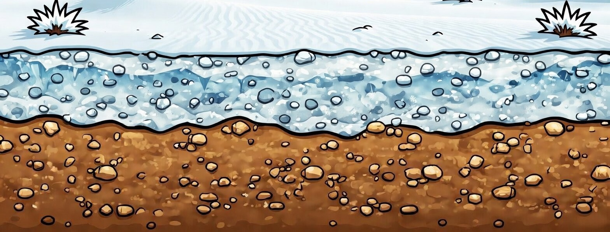

# 📖 GAME DESIGN DOCUMENT (GDD)

  
  <h1>DROPOUT</h1>
  <h3>"O Silêncio Tem Um Preço"</h3>

---

## 1. INFORMAÇÕES BÁSICAS
*   **Gênero:** Endless Runner / Plataforma Momentum-based 2D.
*   **Plataforma Alvo:** PC (Desktop).
*   **Engine / Tecnologia:** Desenvolvido nativamente em PyGame (Python 3.12+).
*   **Estilo de Arte:** Pixel Art polida com iluminação simplificada (Flat Colors/Silhouettes), efeitos Parallax massivos em 5 níveis orgânicos temporais e geração de partículas dinâmicas em tela (vento, chuva e neve de volume extremo).
*   **Tema Central:** Fuga impiedosa, velocidade gravitacional e a busca pela libertação de um infortúnio sonoro (A maldição de nunca conseguir calar-se).

---

## 2. HIGH-CONCEPT
Controle **Japeth**, um bode veloz das montanhas nórdicas amaldiçoado por uma entidade da floresta que o obriga a falar e cantar em voz alta tudo o que imagina. O seu objetivo não é glória, fama ou resgatar uma princesa, mas sim o mais puro e majestoso *silêncio*. Para alcançá-lo, você precisará encontrar a cura: o místico *Berrante Silencioso*, perdido aos pés de uma escorregadia avalanche nas grandes montanhas além das dunas de areia quente.

  
   
  <i>(Japeth, Protagonista do Jogo)</i>

---

## 3. GAMEPLAY CORE (Mecânicas Principais)

### 3.1. Relevo de Ruído e Momentum Orgânico (Kinematics)
Diferente da absoluta vasta maioria de Runners 2D em Pixel Art que usam blocos quadrados, o chão de **Dropout** não possui uma linha reta programada. Utilizando matemática de interpolação complexa por múltiplas frequências e camadas senoides interlaçadas (*Multi-Octave Harmonic Sine waves*), o jogo gera infinitos e incopiáveis vales e desfiladeiros durante a corrida.
*   **Descidas:** Quando Japeth cai a favor do solo, o jogo calcula seu "Momentum". Ele ganha dezenas de fatores de velocidade bruta na física, projetando a câmera ativamente para a frente para acompanhar a visão num tranco cinematográfico (Look-ahead speed).
*   **Subidas:** O atrito da gravidade nas faces dos morros corta drasticamente a velocidade em até 40%. Para não perder tração, o jogador deve se lançar ao ar pulando as ladeiras.

### 3.2. A Economia Tática de Estamina
O fator sobrevivência não é apenas reagir ao chão, é administrar milimetricamente as únicas duas ferramentas de salvaguarda, ambas integradas na pesada de barra de Estamina (Canto Superior Esquerdo).
*   **Planar (Segurar Espaço):** Abre e estica sua capa de pano no meio do céu. Você corrige rotas terríveis e ganha segundos de flutuação caindo 80% mais lento, porém, ele esgota assustadoramente rápido a sua barra de vitalidade.
*   **Dash/Impulso Lateral (Shift):** Cria um disparo horizontal instantâneo anulando qualquer gravidade e ignorando velocidade. A solução para transpor morros gigantes e buracos colossais imediatamente, porém suga longos 30% da barra em uma tacada só. Se errar a conta temporal (Cooldown), não há volta.

### 3.3. Ritmo de Transições Biológicas
O mundo flutua em camadas estáticas num autêntico degradê longo de dezenas de segundos sem **nenhuma barreira ou loading screen**.
1.  **Plain (Florestas de Terra):** Relevo ondulante padrão super fluído com atrito básico de terra úmida. O predador regional natural que lhe espreita é o **Lobo**.
2.  **Desert (Grandes Dunas):** Muito mais arenoso e arrastado. O espaço entre os desfiladeiros e topos das vales são distantes, e o jogo lhe sabota em longos mergulhos. O predador natural são os **Escorpiões**.
3.  **Snow (Picos Gelados):** A reta final. O jogador ganha pouca tração natural (atrito = 0.5) mas quando o terreno embola e afunila tudo fica descontrolado e escorregadio, exigindo pulos perfeitos para não afundar nos inúmeros buracos. O perigo natural repousa nos gigantes **Golems de Gelo**.

---

## 4. INIMIGOS (A AMEAÇA EXTERNA)
Encostar num espinho ou chifre não arranca um pedacinho da vida, ele acarreta num sumário e inegociável `Game Over`. Porém, as caixas de impacto ("Hitboxes") invisíveis do Pygame foram brutalmente encolhidas frente ao desenho dos bichos em exatos 50%. A intenção do Design ("Skill-Fairness") nunca é matar o usuário esbarrando pelos pixels do cabelo ou da cauda por descuido, enaltecendo apenas cortes diretos no crânio duro ou o contato total do centro de massa do bode nos predadores.

| Identidade do Inimigo | Habitat Exclusivo | Arte Referencial | Comportamento IA (AI Matrix) |
|---|---|---|---|
| **Lobo Feroz** | Florestas (Plains) | `<assets/enemies/wolf/wolf.png>` | Um caçador estático. Ele não tenta avançar, ele trava-se no topo final de grandes rampas. Você morrerá se errar saltos curtos na decida. |
| **Escorpião Rei** | Deserto (Desert) | `<assets/enemies/scorpion/scorpion.png>` | É um corredor agressivo e rápido (`vx = -100`). Corre contra o contra-fluxo da tela subindo freneticamente nas dunas soltas pra cravar Japeth numa bica fatal. |
| **Ice Golem** | Picos Gelados (Snow)| `<assets/enemies/ice_golem/ice_golem.png>` | Cuidado extremo. Ele é colossal e virtualmente impossível de sobrevoar com o dash sem preparação. Ele marchava pesadamente e atua como uma barreira física indutora de dor escorregadia no seu momentum de fuga. |

---

## 5. DESIGN DA UI E EFEITOS SONOROS

### 5.1. Audio Ducking Cinematográfico Profissional
Sempre que a história principal pedir o palco, ou o seu próprio personagem disparar as falas "cantadas" aleatoriamente enquanto brinca no escuro (cooldown randômico de 8 a 20 segundos para soltar as amaldiçoadas melodias vocais), o motor central de PyGame processa e derruba gradativamente e silenciosamente o `Theme Principal` inteiro em LERP reverso, enaltecendo a voz do dublador sobre o som ambiente! Tudo flui e volta harmoniosamente depois que as vozes encerram para garantir que o jogador entenda organicamente as ações in-game.

### 5.2. Animação Biológica (Mola LERP Material Design)
Todo o Menu de transição da tela principal de madeira recusa transições e highlights instantâneos brutos do cursor em "Hover". Tudo é interligado via Delta Time (Tempo em Milissegundos) criando "inchaços" fluidos e expansões magnéticas e gelatinosas quando você passa o ponteiro nos itens. Adicionalmente, seu botão Primário (`JOGAR`), atua como o coração do jogo com pulsações próprias via curvas de Seno oscilantes (ele literalmente "respira") lhe convidando para mergulhar no Runner.

  
   
  
<i>A preparação para o Evento de Reta Final — "The Final Avalanche Stretch".</i>

---

## 6. PROGRAMAÇÃO E SEGURANÇA NA ARQUITETURA
O backend do Dropout abraçou a Engenharia de Software Moderna num mar de PyGame abandonando a prática massiva do "Espaguete Mono-Arquivo" em prol da modularidade segura:
*   **State Pattern Loops** na "Main Pipeline": `Menu`, `Options`, `Tutorial`, `Story`, `Playing`, `Paused`, `Ending` reagem e destroem o loop principal sequencialmente, matando ram-leaks.
*   **Dynamic Sprite Matrix Slicing**: Padrão inteligente que entende todo e qualquer png solitário que você por numa pasta de Inimigo da "Factory" (`MonsterManager`) descobrindo sozinhos se os bichos têm 3, 5 ou 8 animações, cortando e distribuindo a arte perfeitamente sem o autor amarrar scripts adicionais.
*   **Sistema de Câmera Vertical Desacoplada**: A câmera parou de seguir cada engasgo e pulo duplo de 2 metros que Japeth executa. O Y target central da sua visão é escravo puro da topologia das montanhas geológicas debaixo do bode! Você sabe em tempo real e perfeitamente onde vai pousar após despencar 50 pixels pra cima. 

---
